# Architecture

## Purpose and operating posture

This project monitors first-party Pokémon TCG inventory, normalizes permitted
Discord signals, records market evidence, and runs a guarded purchase workflow.
It defaults to paper mode and treats direct retailer inventory as authoritative;
a social alert alone cannot authorize a purchase.

Live execution is deliberately incomplete until an operator supplies current,
measured endpoints, selectors, an authenticated local account/session, and a
passing seven-day evidence gate. Human challenges are pause/resume boundaries,
not automation targets.

## End-to-end flow

```mermaid
flowchart LR
  A[Retailer discovery / permitted signals] --> B[Normalize and match watchlist]
  B --> C[Measured inventory contract]
  C --> D[Traffic and URL policy]
  D --> E[Detection]
  E --> F[Safety policy and reservation]
  F --> G[Durable purchase task]
  G --> H[Paper harness or measured browser recipe]
  H --> I[Confirmation or uncertain reconciliation]
  I --> J[SQLite ledger, metrics, alerts, reports]
```

`src/scalper/wiring.mjs` is the composition root. Production entry points load
environment values, open the shared SQLite state store, import measured product
endpoints, construct transports and site lanes, and then create the
orchestrator. Unit tests inject memory stores, clocks, IDs, HTTP clients,
browsers, and delays instead.

## Major components

| Area | Primary modules | Responsibility |
|---|---|---|
| Composition | `wiring.mjs`, `runtime.mjs`, `serve.mjs`, `cli.mjs` | Build dependencies, select accounts/sessions, start lanes and the loopback dashboard. |
| Signals | `discord-feed.mjs`, `discord-parser.mjs`, `monitor-parser.mjs`, `signal-inbox.mjs`, `url-resolver.mjs` | Accept authorized bot/imported messages, deduplicate, parse, unwrap safe links, and rank signals. |
| Discovery | `retailer-discovery.mjs`, `discovery-cycle.mjs`, `inventory-discovery.mjs`, `inventory-scanner.mjs` | Broad public discovery plus exact measured inventory reads. |
| Execution | `orchestrator.mjs`, `task-state.mjs`, `checkout-recipes.mjs`, `challenge-broker.mjs` | Serialize work, persist state transitions, run measured actions, pause for humans, and recover after restarts. |
| Safety | `safety.mjs`, `dry-run.mjs`, `attestation.mjs`, `retail-url-policy.mjs`, `rate-limit.mjs`, `canary-readiness.mjs` | Enforce mode, budgets, one-unit limits, duplicate reservations, cart invariants, hosts, request rate, and readiness. |
| Persistence | `db.mjs`, `state-store.mjs`, `backup.mjs` | Own the SQLite schema, migrations, atomic state changes, permissions, and backups. |
| Browser/session | `browser-session.mjs`, `transports/browser.mjs`, `transports/browser-http.mjs`, site `session.mjs` files | Reuse ordinary local Chrome profiles and expose testable browser/HTTP interfaces. |
| Operations | `health.mjs`, `doctor.mjs`, `metrics.mjs`, `operations.mjs`, `burn-in.mjs`, `dashboard.mjs`, `install.mjs` | Diagnose, report, collect evidence, control the kill switch, and install the local macOS service. |
| Market | `market-sources.mjs`, `market-tracker.mjs`, `market-score.mjs` | Collect authorized pricing observations and apply profitability/freshness gates. |
| Retailer lanes | `sites/<site>/` | Isolate site configuration, availability parsing, session behavior, checkout adapter, and lane lifecycle. |

## Durable state and invariants

Node's built-in `node:sqlite` stores tasks, task events, purchase reservations,
drops, human challenges, idempotency keys, seen Discord messages, and measured
product endpoints. The database uses foreign keys, WAL mode, full synchronous
writes, a busy timeout, and `0600` permissions. Legacy JSON state has an
idempotent migration path.

Purchase tasks move through explicit states:

`queued -> detected -> authorized -> launching -> navigating -> carting -> checkout -> submitting -> confirming`

Challenge handling branches through `awaiting-human` and `resuming`; a safe
pre-submit failure can use `retrying`. Terminal states are `purchased`,
`paper-confirmed`, `blocked`, `failed`, `uncertain`, and `cancelled`. Invalid
transitions are rejected. Ambiguity at or after commit becomes `uncertain` and
keeps the reservation active until manual reconciliation.

The ledger enforces one active reservation per product key, per-order and daily
spend ceilings, quantity limits, price/seller policy, and market-evidence
freshness. In-memory product locks and per-site queues reduce concurrent races;
SQLite uniqueness and leases provide the durable boundary.

## Configuration and data ownership

- `.env` holds local feature flags and secret-bearing environment values.
- `config/scalper-accounts.json` holds local identity metadata and Keychain
  references. It is never committed.
- Shared `config/*.json` files describe watchlists, public URLs, measured read
  contracts, market policy, Discord routes, and recipe structure.
- `data/scalper/` owns every runtime artifact: database/WAL files, profiles,
  sessions, captures, reports, inbox, logs, backups, and kill-switch state.

See `config/README.md` and `SECURITY.md` for the exact version-control policy.

## Reliability model

- A per-site token bucket, retry/backoff classification, `Retry-After` support,
  circuit breaker, timeout, and redirect allowlist govern polling.
- Discovery transitions and Discord messages are durably deduplicated.
- Checkout progress is journaled, leased, and recoverable after a process
  restart.
- Alerts are outside the purchase critical path; a notification outage cannot
  corrupt an otherwise completed paper transaction.
- Readiness is inspection-only. It requires paper staging, active kill switch,
  spend limits, one-unit quantity, account/session, measured recipe and poll
  endpoint, real detection/latency evidence, successful reconciliation,
  delivered alerts, zero duplicates, and a completed burn-in.
- Tests and simulations never require outbound mutations. Recorded retailer
  fixtures must be redacted and contract-shaped.

## Extension points

To add a retailer, implement `sites/<site>/config.mjs`, `detect.mjs`,
`session.mjs`, `checkout.mjs`, and `index.mjs`; add the site to the calendar,
URL policy, runtime lane factory, traffic configuration, and test matrix. Keep
the detector pure where possible and inject all I/O. Add out-of-stock,
in-stock, timeout, challenge, duplicate, unsafe-URL, and ambiguous-submit tests.

To add a signal source, normalize it to the existing drop message/drop shape,
apply an explicit authorization and allowlist policy, route URLs through the
retailer-domain policy, and use durable deduplication. Signal sources may
suggest products but must not replace measured inventory or the safety gate.
